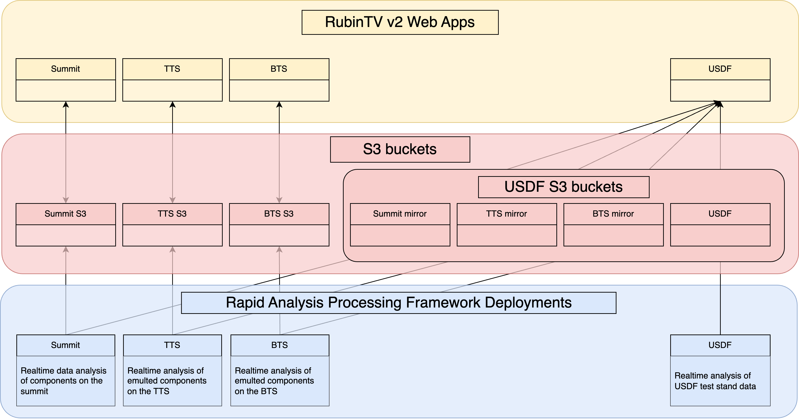
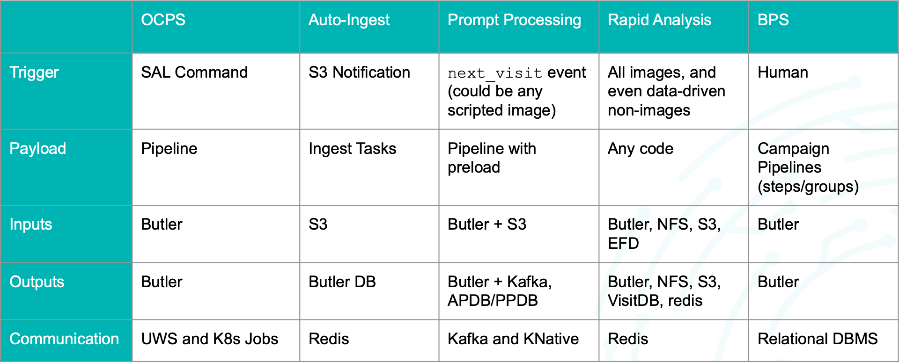
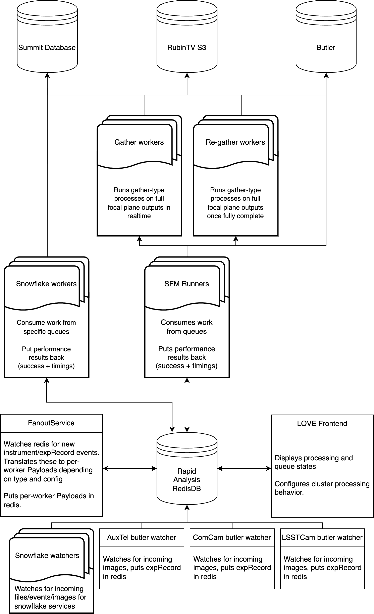
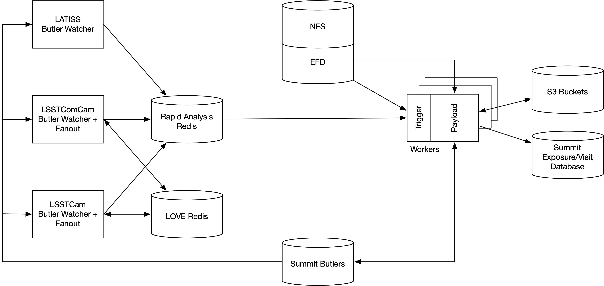
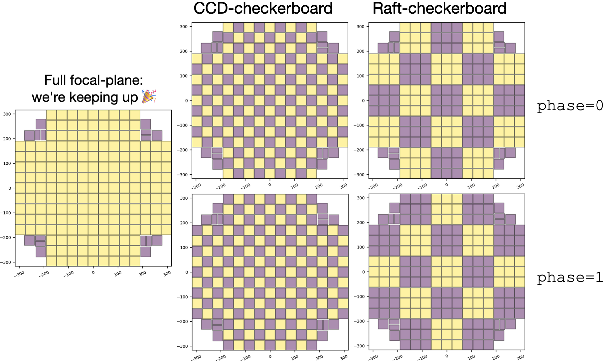

# The Rapid Analysis Framework and its relationship to RubinTV

```{abstract}
Documentation on the architecture of the Rapid Analysis Framework, including its relationship to RubinTV.
```

## Preamble (aka. Merlin's soapbox)

> This technote is both a work-in-progress, because
> 1) it is a provisional version which won't be tidied up until after the design review
> 2) it is documenting a moving target, meaning that there are places where the present tense is used to save having to write everything twice, but where the work hasn't quite been done yet. These are, however, all places where the work is planned and underway, _i.e._ it's not aspirational, it's just not quite finished yet, but will be done on the scale of weeks.

> There are many ways to skin a cat. This is how it is _currently_ being done, but nothing in here should be taken as an assertion that this is how it _should_ be being done, merely that this is how it is at present. It is, however, also worth nothing that without significant intervention and extra effort allocated, it will remain that, due to the limited nature of the allocated effort and the enormous scope of work remaining.

> It is perhaps also worth keeping in mind that the initial architecture was conceived and deployed a) organically _i.e._ as it was required and b) that it came into being in January 2020 with the delivery of LATISS to the summit, so if you find yourself thinking "why doesn't it look like/use X", recall what the DM landscape was like back then, and what existed in terms of leverageable architectures. Given that, I think it's quite surprising how _not_ bad it all is. Of course, YMMV...

## Introduction

Historically, there has been confusion about what Rapid Analysis is, what RubinTV is, and what the relationship and boundaries are between the two. This is because they were developed at the same time, co-evolving with one another. However, they are entirely separate, and totally decoupled, in the technical sense. Therefore, we begin with definitions of each, paying careful attention to say exactly what each is, and is not. This technote will provide a detailed description of, and motivation for, the Rapid Analysis Framework, but does not go into depth about the workings of RubinTV - that will be covered in enough depth to make it clear what it is and where the boundaries are, but no more than is necessary that. It is also worth nothing that some of this confusion came from some poor naming choices made as the co-evolution of Rapid Analysis and RubinTV was ongoing, almost all of which have now been rectified, with the only item remaining to be fixed being that the RA framework still lives in a repo called `rubintv_production`[^package_renaming].

[^package_renaming]: There is not time to fix this before the review, because there is a chance that moving code between repos will break the summit so I don't want to do this in a hurry, but this is top of the list of things to do once it's over.

### What Rapid Analysis is/isn't

Rapid Analysis (RA) is a realtime processing framework. Its customers include commissioning scientists, observers, Telescope & Site personnel including AOS, and during early commissioning, science pipelines folk, and anyone wanting to see what's happening on the summit in realtime and/or have a general situational awareness of what's happening on the summit and how the data-taking is going. It is a set of Kubernetes pods and a work distribution system which runs in various locations, processing data in realtime. Currently, these locations are:
* On the summit
* At USDF
* On the BTS (for bi-directional testing)
* On the TTS (for bi-directional testing)
where "bi-directional testing" means it is there so that we have a test environment where we can test RA itself, but that it is also running as a deployment, processing the test stand data as it is "acquired", in order to support the data acquisition and testing that the test stands themselves provide.

RA is _not_ deployed via phalanx. It is administered via ArgoCD, and the repo which defines the pods and their memory/CPU allocations is [here](https://github.com/lsst-ts/argocd-csc/tree/main/services/rapid-analysis).

Rapid Analysis has several outputs:
* it `butler.put()`s its outputs to the relevant local repo
* it (will) output to the Visit/Summit database
* it sends metrics to Sasquatch
* it sends files to local and remote S3 storage so that data can be displayed on RubinTV

What it is not/does not have:
* it has no frontend
* it does no display of anything
    * In the future it will send data on its health and processing status to LOVE for display.

Because it does render pngs and writes them to an S3 bucket of which RubinTV is a consumer, the package used to be called `rubintv_production`, but is in the process of being renamed to `rapid_analysis` (which, ironically, is what it was called originally, before I was told to rename it).

A principle of RA is to process things as quickly as possible, and when it is unable to keep up (for whatever reason), to only process the most recent image for a given data stream, _i.e._ to prioritize staying present and leaving gaps in the data over having all images processed and falling behind. Some catchup services exist, on a best-effort basis, and to-date they have not saturated, but no guarantees are made with respect to the completeness of processing[^falling_behind]. Details on how this is dealt with are given later the section on [full focal plane processing](#full-focal-plane-processing)

[^falling_behind]: It is possible to guarantee processing all images eventually, or to guarantee always processing the most recent image, but with finite compute resources it is fundamentally not possible to guarantee both, and so a decision must be made about which to prioritize in principle.

### What RubinTV is/isn't

RubinTV is a python web app deployed via Phalanx. It is entirely decoupled from Rapid Analysis, with the data flow (thus far) being strictly one-way, from RA to RubinTV[^rubintv_queries]. To date, everything displayed on RubinTV has been processed and uploaded via RA, but there is nothing that necessarily makes that the case. There are significant plans for data display (the Derived Data Visualization work) that will use RubinTV as frontend, and that will display data which will not have been produced by RA, _e.g._ EFD data.

[^rubintv_queries]: The Derived Data Visualization work will involve user-generated queries being sent to backend databases, meaning that RubinTV will no longer strictly be scraping-only, though I still don't think it will _write_ anything, except, perhaps, to a scratch space.

The RubinTV web app code [lives here](https://github.com/lsst-ts/rubintv/), and has been officially adopted by T&S. It is now deployed via Phalanx, which was necessary for authentication in order to be embargo-compliant.

There are two RubinTV sites for each location, a dev and a prod site.

What RubinTV is not:
* RubinTV does no processing of anything
* Once the Derived Data Visualization code is integrated, it will retrieve data for plotting from:
    * The butler
    * The EFD
    * The Summit/Visit Database

#### The history (and thus the shape) of RubinTV
This section will be deleted, but some background that may be relevant to the review:

Simon helped us put together the initial web app, and thus it was born in the SQuaRE org, and used `saphir`. When it needed to move beyond a web 1.0 hand-crafted html design, I employed Guy Whittaker as a web dev so that I didn't have to learn how to make websites. This initial version was deployed on Roundtable, and stored all its data in GCS. The summit data lives in the `rubintv_data` GCS bucket, with `rubintv_data_tts` and `rubintv_data_usdf` existing to store data from the TTS and USDF respectively. All these were served from a single frontend, which had various locations selectable from the front page, which then told the app which bucket's data to display.

When it became clear that RubinTV was going to live long term, and that its contents would be subject to embargo compliance, v2 was written, which brought about several changes. Firstly, it moved from Roundtable deployment to phalanx. It changed frameworks from `saphir` to `FastAPI`, and moved from GCS storage to being S3 backed, so that we could self-host the data to be embargo-compliant. This move to S3, plus the need to have the summit display be resilient to network outages, necessitated a change in how the web app is deployed and backed. It is therefore now: one S3 bucket per (non-USDF) location, with two web app instances (dev and prod), with each web app hosting the data from its own location, _i.e._ the summit instance shows the real summit data, the TTS deployment only shows emulated data from the TTS, and likewise the BTS shows emulated BTS data only, too. The USDF-hosted web app breaks the pattern, by being the superset of all locations: there are four S3 buckets at USDF: three which are mirrors of the other buckets (summit, TTS and BTS), and a local bucket containing USDF's own data (data created from full camera cleanroom testing, and which continue being generated at USDF for TS8 data). The USDF web apps therefore still have a selectable location, whereas the per-location sites will not, as they only have access to their local data.



#### Where will Rapid Analysis run in the future?

When we hit steady-state operations, the intention is for RA to be deployed:

* On the summit, to process the real data
* On the TTS and BTS, to process their simulated data streams, which has two purposes:
    * To have a place to test the RA framework/deployments before deploying on the summit
    * To support data taking/simulation on the test stand itself
* At USDF, to process TS8 data _only_

That is, there is no intention of keeping RA deployed and running at USDF to process any on-sky or summit data once the camera ships, and that the only deployment at USDF would then be a small one, at the request of the camera team, to allow them to monitor data taking on TS8 in realtime on RubinTV - an activity which is expected to continue indefinitely. The summit's non-pixel-based outputs, _i.e._ the rendered pngs, movies, and metrics etc will be being mirrored at USDF, for analysis and display via RubinTV, but reproducing the processing itself will likely not be necessary. It is worth noting that if it would be _desirable_ to deploy RA at USDF for some reason, that this would be trivial, but it is not intended to be the case, nor currently thought to be necessary.

### What are `summit_utils` and `summit_extras`?

A quick note here about the packages, why they live in [the SITCOM GitHub org](https://github.com/lsst-sitcom/) and not in the `lsst_distrib` metapackage, but instead in `lsst_sitcom`.

These packages break telescope agnosticism, and thus are not allowed in the core DM/Science Pipelines codebase. I initially pushed for this, but understood the point that this code simply does not belong there. It also contains code which people don't like/object to (often because it's not pipeline-like), but which needs to exist, regardless. It also contains a lot a lot of syntactic sugar/one-line-makers to make things easier for summit/commissioning folk (who are not (pipeline) developers).

In `summit_utils`, the test coverage is excellent, and nothing should be added there without adding test coverage. These tests are all run in Jenkins, either as unit tests (where possible), or via the `ci_summit` package when unit testing isn't possible. `ci_summit` runs as part of the nightly build, as well as being available on request. In some sense, bugs and breakages here should be considered worse than in Science Pipelines (if such a thing is even permissible to say!), and code should therefore be as, or even _more_, carefully tested. This is because problems here can directly result in lost telescope time or observing inefficiency, as code in here is relied upon by the scheduler and other closed-loop T&S operational code.

The `summit_extras` package, however, is not like this. It is a place for adding useful code which should live in one place (for all the obvious reasons - passing functions around notebooks is Very Bad, I'm sure we can all agree) but which should explicitly not be relied upon for anything important, operational of scientific[^summit_extras_considered_harmful?].

[^summit_extras_considered_harmful?]: I am certain that some people would argue that the set of code which falls into this category _should be_ empty, because it either should be well-designed and tested and work for all use-cases, or it shouldn't exist. I am, however, not one of those people.

(why-rapid-analysis)=
## Why Rapid Analysis `!=` Prompt Processing Framework `!=` OCPS

> Soapbox section: First and foremost, Rapid Analysis is a pragmatic, "let's say yes/make things happen" arena. That's an odd things to say though, so why am I saying it? There are a large number of brilliant, hardworking scientists working on the summit/elsewhere to commission the system, and many of them are frequently blocked by needing various things to exist which simply weren't planned (at least with respect to data processing and software support), and which, if we stopped to do things the way we'd all like them to be done, would result in significant (read: multiple months) of critical path delays. The point here is that this is real, important stuff, and while saying "we should have done it like X" is definitely a valid point, it needs to price in questions like "would you still say that if someone said it was a critical path activity and doing it that way would delay the activity by ~2 months?".

The overwhelming majority of Rapid Analysis pods will (once the main camera is taking data) be for processing the full focal plane data via Single Frame Measurement. However, when counting by either pod-type or by code line-count[^podcount], the vast majority of Rapid Analysis' deployed services are actually "snowflake services" - realtime processing services for things which have been written from scratch to support a specific non-SFM use-case[^refactor].

[^podcount]: And for now, because LSSTCam is not yet on sky, by count too, but that will, we hope, not remain the case forever.
[^refactor]: It is quite possible that a _little_ of this could be refactored now, but doing that before now would have been very premature, and actually may well still be, or may simply not be worth the effort.

Things in the snowflake services are not (and could never be) `pipelineTasks` because:
* Some data is not ingested - in these cases RA is working on raw files, _i.e._ there is no `butler` involvement. Examples include:
    * StarTracker data
    * All sky camera images
    * `TMAEvents`
    * More to come, I am sure...
* Some services contact the EFD and summit/visit database
    * This involves writing to _and reading from_ the visit/summit database (_i.e._ can't just be sent to Sasquatch, it needs a connection)
* Speed considerations:
    * Starting python and executing `import lsst.*` spin-up time (~20s when last measured)
    * Quantum graph generation delay (used to be about 15s for a single LATISS image when I last timed it, but this was a long time ago and this may now be OK - I don't want to make false accusations - but calibs used to make things bad even for trivial output graphs)
    * Calib caching in the running process (saves ~5s for a full set of calibs)
* Many things do not and cannot have a `next_visit` event as a trigger (CCS images, StarTracker/all sky data, `TMAEvents` etc)
* We need to control the behavior when we can't keep up
    * Summit compute is not elastic the way PP is - RA downsizes processing when images acquisition cannot be kept up with, whereas PP expands to cope with load. See the [Processing Control](#processing-control) section for details on how this is handled.

For non-snowflake processing, _i.e._ regular full focal plane SFM type processing, it's also worth noting that the post-SFM gather-type steps needs special handling to enable their use as a realtime service - see the gather/re-gather section in [Processing Control](#processing-control) for details.

As shown in the comparison table, the various different processing mechanisms have different triggers, payloads, inputs, outputs and communication protocols. Auto-ingest is the most similar to RA, and in fact, the two will likely be combined in some way in the future.




## Rapid Analysis Services

The [snowflake services](#snowflake-services) are all services which have been written from scratch for RA and are not just thin wrappers around SFM. The SFM pipeline pods are covered in the [Full Focal Plane Processing](#processing-control) section, which covers the processing of on-sky images for LSSTCam, LSSTComCam and LATISS via SFM (LATISS, when taking survey images, is also "full focal plane processing", it just has a single chip).

The diagram shows the high-level relationship between various system components. More detail is given on this later, but the high level design is: the various types of watchers watch for new images, events or files being created, and announce these to the fanout service. The fanout service then sends the work to the various type of workers, all of which is mediated by Redis. The snowflake workers run their pipelines, and output their results to the visit/summit database, RubinTV S3 and the summit butler. The fleet of SFM workers run the regular SFM pipeline on the detector images, and once the processing is complete, notify Redis that they have finished processing, at which point the gather/re-gather workers run any full focal plane gather-type processing, and the results are again written to all the locations shown. The workers report their status back to Redis, which allows LOVE to display the overall cluster status, and also gives observers high-level control over the cluster processing behavior.


(snowflake-services)=
### Snowflake Services

All sky images
: A service (outside of RA) writes files to a fixed root path on disk at the summit, with the subdirectories named by the `dayObs`. The all sky services monitors this path for new per-day directories, and once they exist, scans for new files, and each time one lands, re-stretches the PNG file to enhance the contrast, overlays the cardinal directions on it, overlays the time the image was taken, and sends it to S3 for display on RubinTV, as well as uploading it to the EPO GCS bucket for public display. Every 10 minutes, all images taken the on current day are animated, and the updated animation is sent to S3 for RubinTV display. These images are not ingested, and an obs_package does not exist for them, nor is there one planned, as far as I am aware. At the end of each day the temporary files are deleted and the final animation is sent to S3 for access in RubinTV via the all sky "historical" section for posterity.

StarTracker Image Processing
: For every image taken by the three Star Tracker cameras (wide, narrow and fast) a `wcs` is constructed from the image headers (including fixups), source detection is run, and an astrometric solution is found via a custom interface to astrometry.net (this is a local command line solve, not an web API call). The offset between the fitted `wcs` and the nominal TMA pointing is calculated, and the various WCS parameters and residuals with respect to the nominal pointing are sent to RubinTV for display. These images are not ingested, and a working obs_package does not exist for them.[^startracker_obs_package]

[^startracker_obs_package]: Once it does, image retrieval and WCS creation could be done via a butler and `afwImage`, but this does not really gain RA much, though it would make some people happy. However, despite being this being "imminent", I've been waiting >13 months for this to happen, and this has still not been brought to a conclusion despite being "nearly done" for more than 12 months, now.

Monitor Image Serving
: For each new LATISS image, this service renders a `.png` of the post-ISR focal plane and sends it to S3 for display on RubinTV. It also pulls metadata from the image, and sends it to the LATISS `MetadataServer` for dispatch to RubinTV (and once it exists, the Summit/Visit Database).

Metadata Servers
: These are a long-standing workaround/crude substitute for the visit/summit database. Any running service can write a `metadataShard` to a specific directory, with the directory being determined by which instrument it relates to. These `metadataShards` are `json` files which are named by the `dayObs` that the data relates to, and contain one-or-more dictionaries of data, keyed by `seqNum`, containing one or more values for that `seqNum`, _i.e._ one or more columns values for that `seqNum`-row. These files are then collated and merged into a per-`dayObs` `json` file, on a timer, by the `MetadataServer`. This allows any running service to asynchronously put one-or-more values into the table (_i.e._ enables partial row updates), with the value(s) simply updating the value(s) in the table. This makes partial, asynchronous, inter-process writes trivial, at the expense of having a proper database. These are the sources of truth for the tables on RubinTV.

Night Report Generation
: This is a service which creates a selection of pre-defined plots throughout the night. Each time a new image is taken, all the plots are recreated and sent to RubinTV. There is an small framework which makes adding new plots very easy so that summit users/commissioning folk can easily add plots here to appear on RubinTV. It is possible that this will be deprecated/removed once the Derived Data Visualization work is done, but that remains to be seen, as it is possible there will still be a reason to have these made in a fixed and automatic way (for example, to add some plots automatically to observers' end-of-night reports).

Catchup Service
: This is a custom-written service which finds gaps in the processing for various channels, and runs those images through their respective "pipelines" (not `pipelineTask`s but the respective unit of work for a given instrument/image/channel). This is specifically used for catchup on snowflake services - full focal plane catchup processing a very differently shaped problem, and is covered in [Full Focal Plane Processing control](#processing-control).

ImageExaminer (service likely needs replacing)
: For each new LATISS image, this service creates a `.png` containing some very quick (order of 1 second including i/o) canned analyses which are appropriate to run on all LATISS images, and sends it to S3 for display on RubinTV. This was a very quick and dirty service which was thrown together, and likely could do with a total rewrite now that other software has matured.

SpectrumExaminer
: For each new dispersed (spectral) LATISS image taken, this service creates a `.png` containing a very quick (order of 1 second including i/o) "spectral reduction" and sends it to S3 for display on RubinTV. This provides realtime feedback for observers and scripts, providing a measurement of the main source signal level and the spectrum's continuum flux in ADU/s so that exposure times can be adjusted dynamically.

AuxTel Mount Torque Analysis
: For each LATISS image for which the mount was moving[^2s_limit], the mount position and motor currents (torques) are pulled from the EFD for each of the three axes. The residuals from the nominal pointing are calculated, and the spurious mount motion RMS and its contribution to the delivered image quality are calculated. This metric is sent to RubinTV, along with a plot of the mount motion profiles and residuals. The mount performance metrics and image degradation numbers will be sent to Summit/Visit Database once that is possible.

[^2s_limit]: Tracking movements which are shorter than 2s are currently skipped due to a processing limitation. It is quite likely that this is now fixed, and this limitation can be removed. The code is already in the process of being refactored to support processing TMA movements with the same code.

TMA Event Generation
: A `TMAEventMaker` is run in a loop, such that every time the TMA moves, new events are generated from the EFD via the `TMAStateMachine` (see [SITCOMTN-098](https://sitcomtn-098.lsst.io/) for the technical details on `TMAEvent` generation). For each new TMA movement, various bits of telemetry are pulled from the EFD, and plots and metrics are created from them, and are sent to RubinTV for display (and will be sent to the Summit/Visit Database once it is possible).

(full-focal-plane-processing)=
### Full Focal Plane Processing

For the sake of simplicity, this section will only consider the summit, but note that similar systems are in place at all locations, with no real architectural differences, just different `instrument`s' data streams being processed.

It is worth noting that fact that RA needs gather-type steps makes it architecturally different to Prompt Processing. Prompt Processing, at least in terms of its _realtime_ behavior, is entirely detector parallel - the only gather-type steps are run at the end of the night, whereas in RA, full focal plane metrics need to be computed constantly, in realtime, as the night goes, as well as generating things like full focal plane mosaic images for display in the control room. This therefore requires its own architecture.

For each `instrument` (which on the summit will be, at some point, likely all of `LATISS`, `LSSTComCam` and `LSSTCam` simultaneously, due to cleanroom operation), the architecture is as follows:

1) Trigger: A head node watches for new data landing in the instrument's repo[^new_sfm_trigger], and dispatches this in a dynamic and configurable way to the worker nodes, as detailed in [Processing Control](#processing-control).
2) Scatter: This head node, controlled by its `FanoutService`, sends the individual CCD-images to a pool of `SFMRunner`s for processing through the normal DM Single Frame Measurement pipeline[^SFM_caveat], in a scatter-type step. This fanout and the workers themselves support detector affinity, in order to enable caching of calibs, but the system does not _require_ pods to have detector affinity, _i.e._ it also supports generic pooled workers as well.
3) a) Gather: Once the first (random) detector-image finishes processing (or, in fact, once any particular step in its processing is reached, which therefore includes, but is not limited to, finishing), a configurable timeout begins in a gather process. If all the data lands before that timeout, the gather process runs as soon as it is all present, and if not, the gather-type processing begins with whatever CCD exposures have been processed at that point in time. The intention here is that this configurable timeout is set such that, for normal operation, the majority of images will finish processing in this time, such that the focal plane is usually complete, but is not set to be so large as to hold up realtime feedback being delivered to observers in situations where image processing is delayed for any reason.
3) b) Re-gather: if the timeout above was reached _i.e._ the gather step processed a partial focal plane due to reaching the processing timeout, then after some (much longer, configurable) timeout, another gather process runs using what will be (modulo actual failures) data from the entire focal plane, and updates the plots and results.

[^new_sfm_trigger]: It would be very easy to change the trigger for SFM to use the same mechanism as the auto-ingest framework and/or integrate the two frameworks' triggering, to save polling the butler, but it should be noted that only applies to SFM-type and other raw-image processing. Both are already using Redis for work distribution.

[^SFM_caveat]: The shape of the pipeline, and the processing code itself, is the same as for command-line SFM, _i.e._ when it is run with `pipetask run`, and it can be configured (programmatically) to behave in exactly the same way as command-line SFM run via `pipetask run` but, for all the speed reasons outlined [previously](#why-rapid-analysis), it is not currently run through either the command line architecture, nor with a `SimplePipelineExector` or `SeparablePipelineExecutor`. It is possible that we could move to this in the future if the technical issues with caching and task startup are circumventable.

To give an idea of these values, currently when serving full focal plane mosaics in the cleanroom, the initial timeout is set to 5s, and the re-gather timeout is set to 45s, with the currently-minimal ISR that's being run usually finishing in ~3-4s.

All intermediate (non-butler) data products are written to a scratch area, and deleted after final use by either the gather or re-gather step. Only the final outputs are kept, _e.g._ the calexps and visit tables etc are `butler.put()`, plots are sent to RubinTV S3, and metrics to the visit/summit datavbase.



(processing-control)=
#### Processing control

Full focal plane processing behavior is both dynamic and configurable: it is dynamic, in that it can automatically down-select which images are processed based on the image acquisition rate and how well the cluster is keeping up. The behavior for when we are not perfectly keeping up is configurable via LOVE[^control_caveat].

[^control_caveat]: And via notebooks for a _very_ select set of power users, and _only_ for use in development and testing.

##### Dynamic focal plane selection

Work distribution proceeds from the head node, to the `FanoutService`, to the workers, via `redis`. The fanout service allocates work based on the current `CameraControlConfig`'s selection of CCDs and whether the processing is keeping up. There are many modes of operation one could imagine, and the code has been written to allow for arbitrary selections, but to paint a picture of a few scenarios which it is already setup to support:

* We keep up: every image has the full SFM pipeline run on every science detector - the focal plane is complete.
* CCD-checkerboard: in order to keep up, we select ~half of the CCDs in order to keep full area coverage but at half load.
* Raft-checkerboard: we similarly down-select, but at the raft level. This gives more continuity at small scales at the expense of worse spatial sampling of the focal plane.
* Arbitrary patterns: any pattern you can image can be selected (spirals, rings, crosses, e2v/ITL-only etc), and these can be predefined, or (eventually, with a little LOVE effort) even selected in the control room.

For a given pattern, one can imagine several modes in which the pattern varies with time, too, which again, will be selectable via LOVE:

* `fixed`: the selected pattern persists while we are unable to keep up.
* `alternating-phase`: the phase of the checkerboard pattern flips between images to ensure we don't always process some detectors while ignoring others.
* `alternating-by-twos`: the phase of the checkerboard pattern flips every _other image_, such that we still ensure we don't always process some detectors and ignore others, but also ensures that we always have always processed consecutive exposures on a given CCD, for easier comparison.
* `id-guaranteed`: for a specific exposure id, process the entire focal plane regardless of whether it will cause us to fall a little behind while processing takes place. This would be useful for ensuring that scientists will have all the relevant data products for an image that was taken for a specific reason.
* Any other behavior you can dream of programatically.




##### Processing modes

It is also possible to determine the behavior of the workers themselves. Currently, two modes are implemented, with a third envisioned but not yet really technically devised.

* `WAITING`: Each detector's pod sits and waits for the next image to land. Once one is available, SFM runs to completion, `butler.put()`ing the resulting calexp as well as writing out some intermediate metadata shards which are collated and sent to Sasquatch and the Summit/Visit Database and RubinTV. Once the processing is finished, the pod waits and does not process any images in the backlog queue, waiting for a new image to land.
* `CONSUMING`: Each detector's pod processes its most recent detector image as per `WAITING`, but if, once finished, a new image has not landed, the most recent image on the backlog queue will be processed, continually, until a new image lands.
* `MURDEROUS`: This is a best-of-both-worlds hybrid of `WAITING` and `CONSUMING` where the most recent image is always let to run to completion, but if the image in progress came from the backlog queue and a new image lands while processing is not yet finished, progress is abandoned and the image is put back on the backlog queue. This mode does not yet exist.

The `WAITING` mode has the least latency, but means compute sits idle, whereas `CONSUMING` mode ensures that the compute is always working (while there is work to do), but means that new images will not start for the balance of the in-progress SFM pipeline, which can be up to ~60s. `MURDEROUS` would be a best of both worlds hybrid, but is non-trivial to implement. Other modes of operation including pooled workers (both with and without detector affinity) are also being considered, but a concrete answer as to the number of available cores is needed to inform the best approach there.


## Notes

### Development workflow: `git-pull` on pod start
> Note: This is not a feature of the framework itself. This is the current state of play, and something I have found to be pragmatic, an extremely quick and low-friction workflow, and has _not yet_ resulted in any disasters, and has allowed for hotfixes which are both mentally easier and orders of magnitude faster. I am, however, very _very_ open to other, better ideas here!

It is very common to want to hotfix things on the summit, either to quickly deploy bug fixes, or to push out new features in realtime (and often both, where new features are being developed and debugged as part of their development). Currently, the way this is done is by having a small, pre-selected set of `eups` managed DM packages which `git pull` from a `deploy-summit` branch on pod startup, as changes here really only touch a few parts of the codebase in practice. The main downside here is that these branches must be kept compatible with the base image or the service will fail, and while this is not hard for experts, it does require some breadth of knowledge and care to be taken. It does, however, have has several advantages to a more traditional development workflow.

Normally, this would be done with a full pod rebuild, but this is slow (at least 30 minutes, I think). Not only is the pod build slow, but the image pull is then also slow for new images (often around 10 minutes), and hotfixes often want to be much much faster than either of these, let alone their sum. Then there is the fact that it is not always possible to fully test things before pushing, meaning it's not all that uncommon to need to iterate a few times (and when things are already broken it's OK to push a non-working fix because you're already dead in the water).


### Techdebt

There are several places where Rapid Analysis has significant tech debt. Some of it is minor, but ugly and just in need of a tidy-up because it was done in a hurry, but some of it is deeper and a risk to ongoing stability and maintenance, and hinders development.

Minor:
* `LocationConfig`: This is honestly just pretty gross. It is not a hard fix, but it does need doing.
* Package (and some file) renaming. Need to finally deal with the hangover of `rubintv_production` etc.
* Some channels are just a bit ugly/hacky because they were written in a hurry and then ignored once they worked. They're only the low priority ones though, e.g. all sky camera.

Major:
* Test coverage - both unit tests and CI testing: The test coverage is frankly shocking - it is currently about 25%. This not only makes development harder and more scary, but hinders larger, more refactoring-like work, and thus causes a vicious circle, with the debt compounding as the lack of tests makes tidying up itself more difficult.
* RA pod build system and devOps work: It may well be that there's no real tech debt here, it may just need more FTEs. Basically it just needs to be so that it doesn't need to be done me and Tiago (though I think Sebastian might be able to help here, now).
